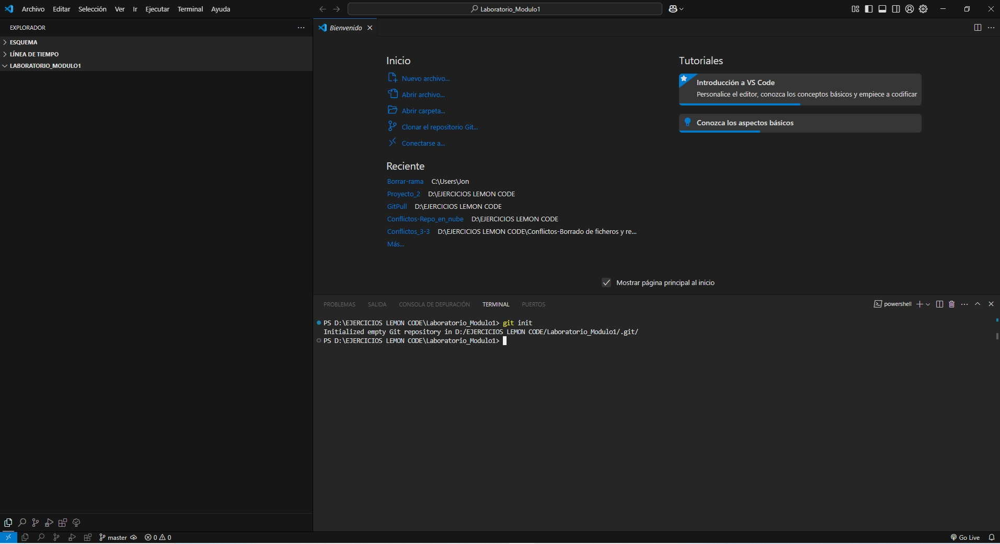
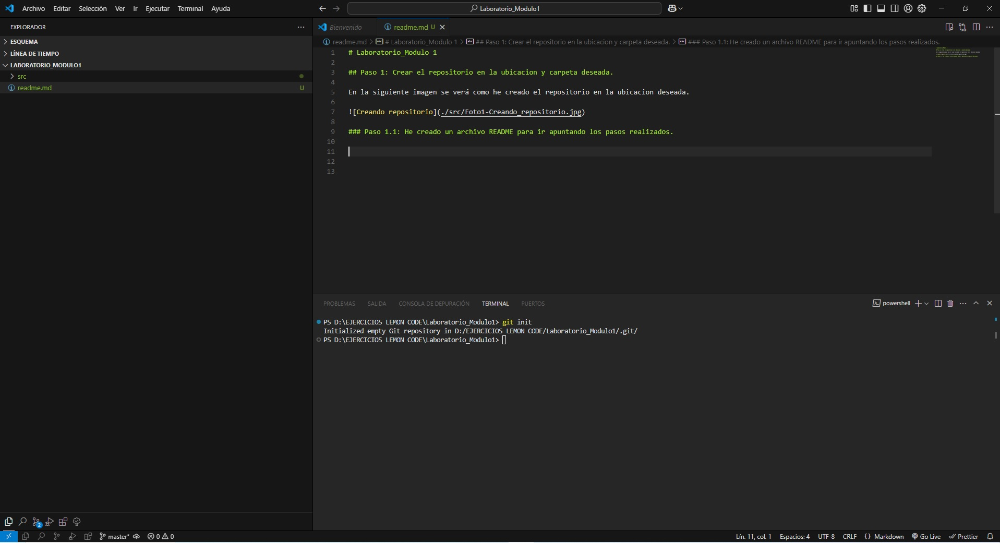
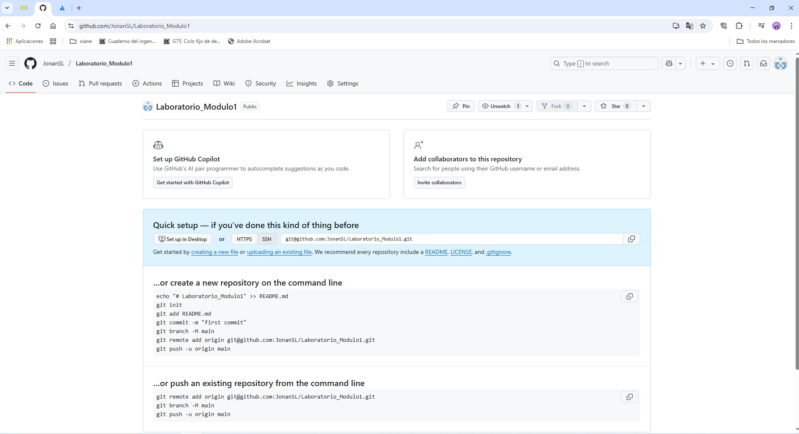
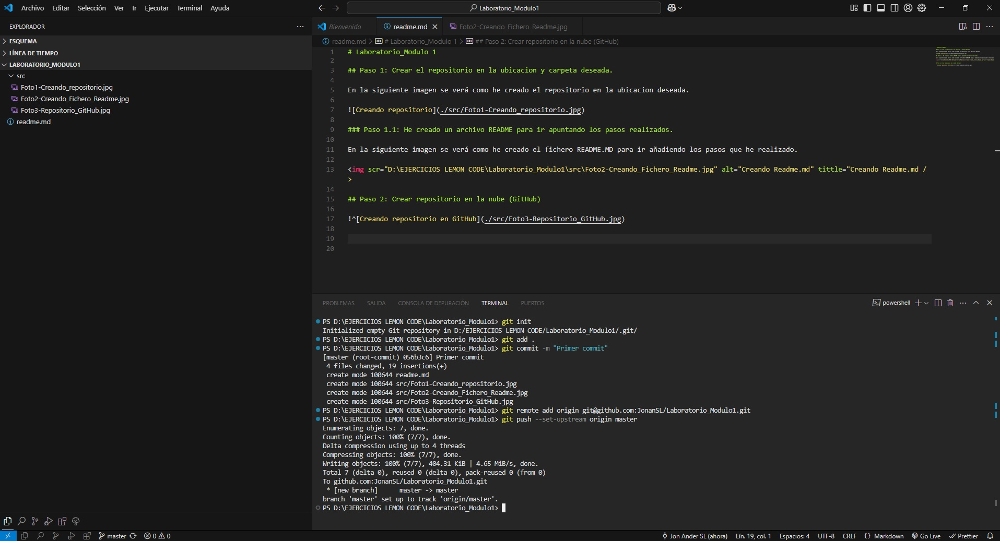
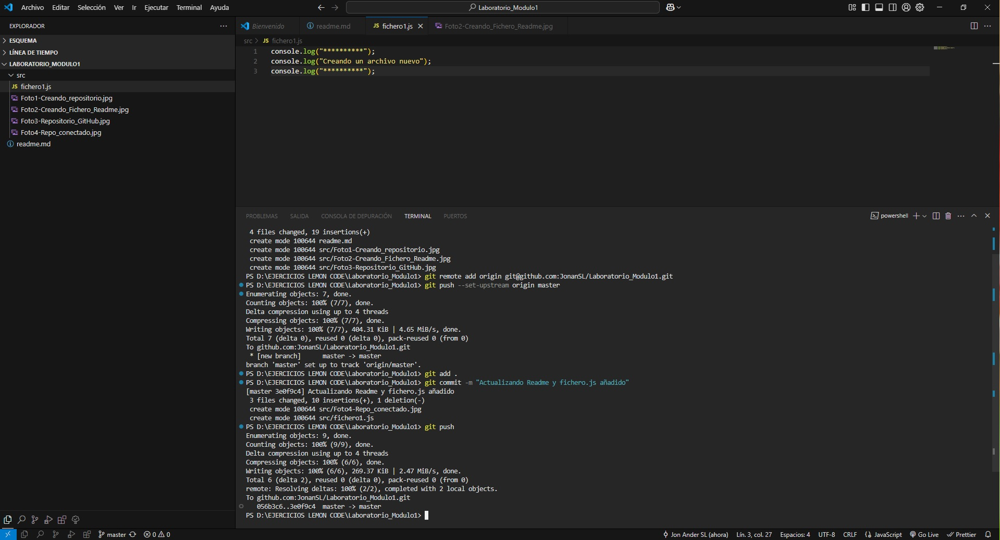

# Laboratorio_Modulo 1

## Paso 1: Crear el repositorio en la ubicacion y carpeta deseada.

En la siguiente imagen se verá como he creado el repositorio en la ubicacion deseada.

### Paso 1.1: He creado un archivo README para ir apuntando los pasos realizados.

En la siguiente imagen se verá como he creado el fichero README.MD para ir añadiendo los pasos que he realizado.

## Paso 2: Crear repositorio en la nube (GitHub).

### Paso 2.1: He conectado el repo local con el repo en la nube (GitHub).

En la siguiente imagen se verá que he conectado el repo local con el de la nube (Con el archivo Readme).

## Paso 3: He creado un archivo .js, lo he puesto en staging (git add .), lo he commiteado y lo he enviado al repositorio de la nube.

En la siguiente imagen se ve el archivo creado, el staging, el commit y el push.

## Paso 4: Creando rama nueva "Development", modificando fichero .js, commitear los cambios y subirlos al repositorio GitHub

En la siguiente imagen se ve la rama creada, el archivo .js modificado, el commit y el push.

